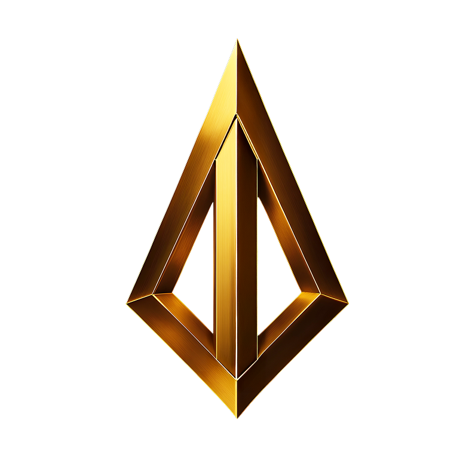
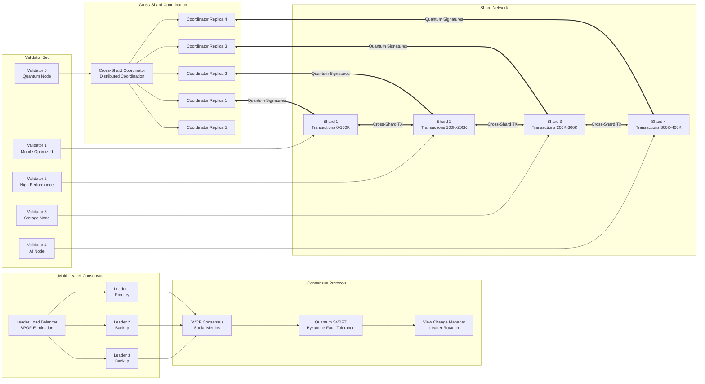
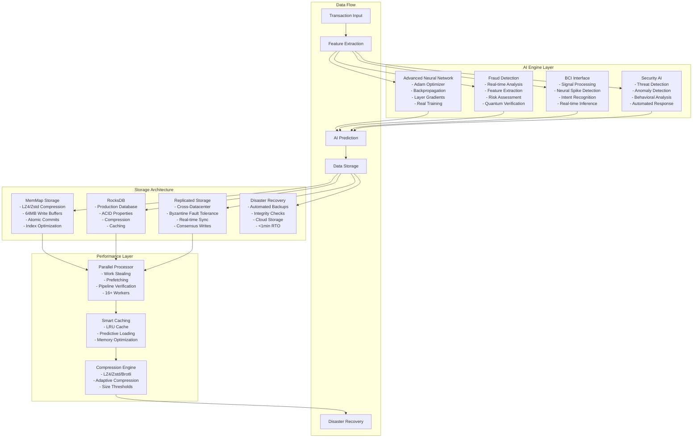

# ARTHACHAIN


**ArthaChain - A Blockchain Developed By DIIGOO Tech Private Limited, from India to the World of Future**

*Decentralised Indian Innovation for Global Open Opportunities (DIIGOO)*

We believe technology should carry meaning, unlock power, and be written in code that shapes the future.

**ArthaChain**  
*Meaning. Power. Code.*

---

## The Next Generation of Blockchain Technology

ArthaChain represents a paradigm shift in blockchain architecture, delivering unprecedented performance, security, and scalability through advanced consensus mechanisms and quantum-resistant cryptography. Built with Rust for maximum efficiency and reliability, ArthaChain is designed to handle the demands of enterprise-grade applications while maintaining the decentralization principles that make blockchain technology revolutionary.

## Overview

ArthaChain is a high-performance blockchain platform that combines cutting-edge consensus algorithms with advanced cryptographic techniques to create a secure, scalable, and efficient distributed ledger system. The platform features a comprehensive suite of tools including a real-time blockchain explorer, analytics dashboard, and persistent storage mechanisms that ensure data integrity across network restarts.

## Core Features

### Consensus & Security
- **SVCP Consensus** - Scalable Virtual Consensus Protocol enabling high-throughput transaction processing
- **Quantum SVBFT** - Quantum-resistant Byzantine Fault Tolerance ensuring security against future cryptographic threats
- **Advanced Sharding** - 64-shard system with AI-driven optimization for maximum parallel processing
- **DAG Processing** - Directed Acyclic Graph architecture for parallel execution with intelligent conflict resolution
- **Post-Quantum Cryptography** - Future-proof security mechanisms resistant to quantum computing attacks

### Performance & Scalability
- **Ultra-High Throughput** - Stage 1 performance of 100,000+ TPS with capability to handle 22.6 million TPS
- **Sub-Second Confirmation** - Block confirmation times under 0.1 seconds
- **AI-Powered Optimization** - Neural network integration for fraud detection and performance tuning
- **Cross-Chain Interoperability** - Native bridges to Ethereum, Bitcoin, Cosmos, and Polkadot networks

### Infrastructure & Tools
- **Persistent Storage** - File-based state management ensuring data integrity across restarts
- **Global Access** - Cloudflare-powered global distribution with HTTPS encryption
- **API Services** - RESTful endpoints for blockchain data access
- **Network Monitoring** - Real-time performance and health monitoring

## System Architecture

ArthaChain's sophisticated architecture combines multiple layers of advanced technology to create a production-grade, enterprise-ready blockchain platform.

### Overall System Architecture & API Flow

```mermaid
flowchart TB
    subgraph "Client Layer"
        CLI[CLI Client]
        REST[REST Client]
        RPC[JSON-RPC Client]
        WS[WebSocket Client]
        WALLET[15+ Wallets<br/>MetaMask, Trust, Coinbase, etc.]
    end

    subgraph "API Gateway Layer"
        ROUTER[Testnet Router<br/>Axum-based]
        CORS[CORS Layer]
        AUTH[Authentication]
    end

    subgraph "Core Services Layer"
        BLOCKCHAIN[Blockchain API<br/>Blocks, Transactions]
        CONSENSUS[Consensus API<br/>SVCP, Quantum SVBFT]
        AI[AI Services<br/>Fraud Detection, Neural Networks]
        STORAGE[Storage API<br/>RocksDB, MemMap, Replication]
        RECOVERY[Disaster Recovery API]
        CROSS[Cross-Shard API]
    end

    subgraph "Consensus Layer"
        SVCP[SVCP Consensus<br/>Social Verified Protocol]
        QSVBFT[Quantum SVBFT<br/>Byzantine Fault Tolerance]
        LEADER[Leader Election<br/>Multi-Leader Support]
        VALIDATOR[Validator Set<br/>Dynamic Rotation]
    end

    subgraph "AI Engine Layer"
        NEURAL[Advanced Neural Network<br/>Backpropagation, Adam Optimizer]
        FRAUD[Fraud Detection<br/>Real-time Analysis]
        BCI[BCI Interface<br/>Brain-Computer Interface]
        SECURITY[Security AI<br/>Threat Detection]
    end

    subgraph "Storage Layer"
        MEMMAP[MemMap Storage<br/>LZ4/Zstd Compression]
        ROCKSDB[RocksDB<br/>Production Database]
        REPLICA[Replicated Storage<br/>Cross-Datacenter]
        BACKUP[Disaster Recovery<br/>Automated Backup]
    end

    subgraph "Network Layer"
        P2P[P2P Network<br/>Peer Discovery]
        SHARD[Cross-Shard<br/>Transaction Coordination]
        REDUNDANT[Redundant Network<br/>SPOF Elimination]
    end

    CLI --> ROUTER
    REST --> ROUTER
    RPC --> ROUTER
    WS --> ROUTER
    WALLET --> ROUTER

    ROUTER --> CORS
    CORS --> AUTH
    AUTH --> BLOCKCHAIN
    AUTH --> CONSENSUS
    AUTH --> AI
    AUTH --> STORAGE
    AUTH --> RECOVERY
    AUTH --> CROSS

    CONSENSUS --> SVCP
    CONSENSUS --> QSVBFT
    CONSENSUS --> LEADER
    CONSENSUS --> VALIDATOR

    AI --> NEURAL
    AI --> FRAUD
    AI --> BCI
    AI --> SECURITY

    STORAGE --> MEMMAP
    STORAGE --> ROCKSDB
    STORAGE --> REPLICA
    STORAGE --> BACKUP

    CONSENSUS --> P2P
    CONSENSUS --> SHARD
    CONSENSUS --> REDUNDANT
```



### Consensus & Cross-Shard Architecture



### AI Engine & Storage Architecture



### Architecture Highlights

#### Multi-Layer SPOF Elimination
- **Multi-Leader Consensus**: 3+ active leaders with load balancing
- **Distributed Cross-Shard Coordination**: 5 coordinator replicas
- **Redundant Storage**: Cross-datacenter replication with Byzantine fault tolerance
- **AI-Powered Monitoring**: Real-time threat detection and automated response

#### Production-Grade AI System
- **Real Neural Networks**: AdvancedNeuralNetwork with backpropagation
- **Fraud Detection**: Real-time analysis with 15+ feature extraction
- **BCI Interface**: Brain-Computer Interface with signal processing
- **Security AI**: Automated threat detection and response

#### Enterprise Storage Architecture
- **MemMap Storage**: High-performance with LZ4/Zstd compression
- **RocksDB**: Production database with ACID properties
- **Disaster Recovery**: <1 minute RTO with automated backups
- **Cross-Datacenter**: Real-time synchronization and consensus

#### Quantum-Resistant Security
- **Quantum SVBFT**: Byzantine fault tolerance with quantum resistance
- **Dilithium Signatures**: Post-quantum cryptographic algorithms
- **Quantum Merkle Trees**: Future-proof data verification
- **Multi-Layer Security**: AI + Quantum + Traditional cryptography

## Getting Started

### Live Network Access

The ArthaChain network is currently operational and accessible through the following endpoints:

- **API Gateway**: https://api.arthachain.in
- **Health Monitoring**: https://api.arthachain.in/health

### Running Your Own Node

To participate in the ArthaChain network by running your own node:

```bash
# Grant execution permissions
chmod +x ARTHACHAIN.sh

# Launch the node
./ARTHACHAIN.sh
```

The setup script performs the following operations:
1. System capability assessment and optimization
2. Automatic role determination (mining/validation/sharding)
3. Configuration generation based on hardware specifications
4. Compilation and optimization of the blockchain client
5. Network initialization and peer discovery

### Additional Commands

```bash
./ARTHACHAIN.sh --demo     # Display feature demonstration
./ARTHACHAIN.sh --status   # Check node operational status
./ARTHACHAIN.sh --stop     # Gracefully shutdown running node
./ARTHACHAIN.sh --help     # Display command reference
```

### Node Role Assignment

The system automatically assigns optimal roles based on hardware specifications:

- **Mining Node**: 16+ CPU cores, 32+ GB RAM, dedicated GPU
- **Validation Node**: 8+ CPU cores, 16+ GB RAM
- **Sharding Node**: 4+ CPU cores, 8+ GB RAM
- **Light Node**: Minimum requirements for basic operations

## Network Architecture

### Production Endpoints
- **API Gateway**: https://api.arthachain.in
- **P2P Network**: Port 30303

### Development Environment
- **Local API Server**: `http://localhost:1900`
- **Health Monitoring**: `http://localhost:1900/health`

## System Requirements

- **Rust Toolchain**: Automatically installed if not present
- **Operating System**: macOS, Linux, or Windows with WSL2
- **Memory**: Minimum 4GB RAM (8GB+ recommended)
- **Storage**: 10GB available disk space

## Installation Process

The automated setup process includes:

1. System capability analysis and hardware detection
2. Optimal configuration generation based on system specifications
3. Directory structure creation and permission setup
4. Rust toolchain installation and dependency resolution
5. Blockchain client compilation with performance optimizations
6. Network configuration and peer discovery initialization
7. Service startup and health verification
8. Endpoint activation and connectivity testing

## Technical Specifications

### Performance Metrics
- **Throughput**: Stage 1 performance of 100,000+ TPS with capability to handle 22.6 million TPS
- **Latency**: Sub-100ms block confirmation
- **Consensus**: Byzantine fault tolerance with quantum resistance
- **Scalability**: Horizontal scaling through advanced sharding
- **Interoperability**: Native cross-chain bridge protocols

### Core Capabilities
- **Real-Time Monitoring**: Live blockchain state visualization
- **Historical Analysis**: Complete transaction and block history
- **Advanced Search**: Universal query system across all data types
- **Data Persistence**: Reliable state management across restarts
- **Cross-Platform**: Multi-platform compatibility

### Security Features
- **Quantum Resistance**: Post-quantum cryptographic algorithms
- **Consensus Security**: Byzantine fault tolerance mechanisms
- **Data Integrity**: Cryptographic verification of all transactions
- **Network Security**: Encrypted peer-to-peer communication
- **Access Control**: Role-based permission systems

## Current Status

### Operational Features
- **Persistent Storage**: Reliable data persistence across node restarts
- **Global Search**: Comprehensive search across all blockchain data
- **Global Distribution**: Worldwide access via Cloudflare infrastructure
- **API Services**: RESTful endpoints for blockchain data access
- **Network Monitoring**: Real-time performance and health monitoring

### Network Metrics
- **Total Blocks**: 200+ blocks successfully mined and validated
- **Block Interval**: 10-second block generation cycle
- **Network Status**: Fully operational and stable
- **Data Integrity**: Verified persistence across restarts
- **Search Coverage**: Complete historical data accessibility
- **Analytics**: Real-time performance monitoring active

### Development Roadmap
- **Transaction Processing**: Enhanced transaction creation and validation
- **Multi-Node Architecture**: Distributed validator network expansion
- **Cross-Chain Integration**: Bridge protocols to major blockchain networks
- **Mobile Applications**: Native mobile client development
- **Internationalization**: Multi-language support implementation

## Contributing

We welcome contributions to the ArthaChain project. Please review our contribution guidelines and code of conduct before submitting pull requests.

### Development Setup

1. Fork the repository
2. Create a feature branch
3. Make your changes
4. Run tests and ensure code quality
5. Submit a pull request

### Code Standards

- Follow Rust best practices and conventions
- Include comprehensive tests for new features
- Update documentation for API changes
- Ensure all tests pass before submission

## License

This project is licensed under the Apache License 2.0. See the LICENSE file for details.

## Security

For security-related issues, please contact sainath@diigoo.com. Do not report security vulnerabilities through public GitHub issues.

## Support

- **Documentation**: https://docs.arthachain.in
- **Community**: https://discord.gg/arthachain
- **Issues**: https://github.com/arthachain/arthachain/issues

---

*ArthaChain: Advancing blockchain technology through innovation, security, and performance.*

**Developed by DIIGOO Tech Private Limited**  
*Decentralised Indian Innovation for Global Open Opportunities (DIIGOO)*

*Meaning. Power. Code.*
